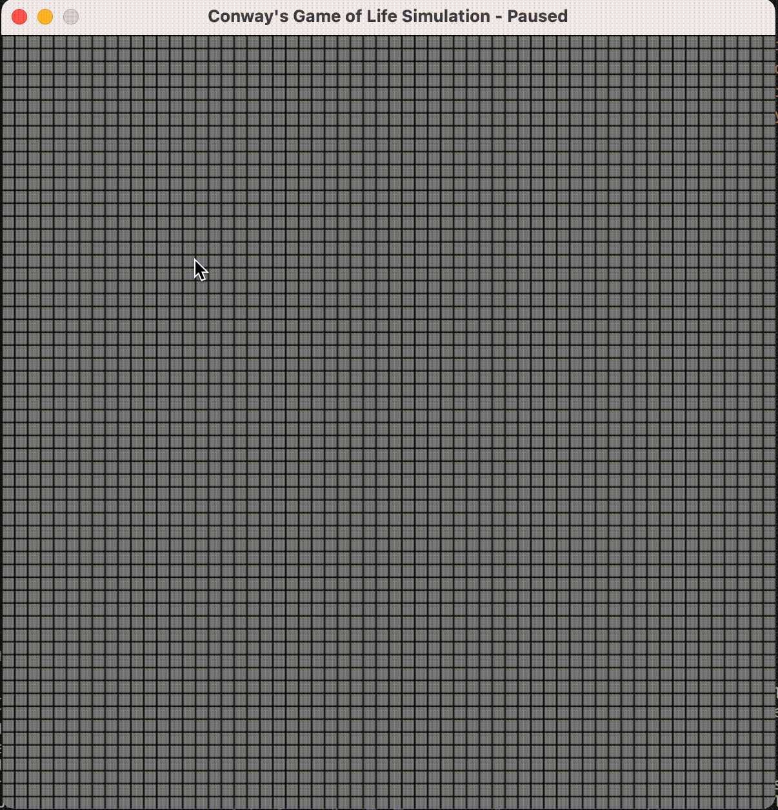

# Conway's Game of Life Simulation

Conway's Game of Life is a classic cellular automaton devised by John Conway in 1970. It is a zero-player game, meaning its progression is dictated by its initial state, with no further input needed. The game's evolution is determined by a set of simple rules.

## Table of Contents

1. [Introduction](#introduction)
2. [Installation](#installation)
    1. [Libraries](#libraries)
    2. [Virtual Environment](#virtual-environment)
3. [Usage](#usage)
    1. [Running the Simulation](#running-the-simulation)
    2. [Customization](#customization)
4. [Contributing](#contributing)
5. [License](#license)

## Introduction

This project implements Conway's Game of Life using Python and the Pygame library. The game allows users to interact with the grid, add or remove cells, and observe how the grid evolves based on predefined rules.

## Installation

### Libraries

To run the simulation, you need to have the following libraries installed:

- `pygame`: Used for creating the graphical interface and handling user interactions.

You can install these libraries using pip:

```bash
pip install pygame
```

### Virtual Environment

It's a good practice to set up a virtual environment to manage your project's dependencies. Here's how you can do it:

Install virtualenv (if not already installed):

```bash
pip install virtualenv
```

Create a Virtual Environment:

```bash
virtualenv venv-name
```

Activate the Virtual Environment:

On Windows:
```bash
venv-name\Scripts\activate
```
On macOS and Linux:
```bash
source venv-name/bin/activate
```

To deactivate the virtual environment, simply run:

```bash
deactivate
```

## Usage

### Running the Simulation

Run the main.py script to start the Conway's Game of Life simulation.

```bash
python main.py
```
### Examples
#### Simulation Running with random initial cells
<p align="center">

</p>

#### Building Gliders
<p align="center">

</p>

### Customization

You can customize various aspects of the simulation:

- Adjust the constants in main.py to change the grid size, update frequency, and random density.


## Contributing

Feel free to contribute to this project! If you have any suggestions, ideas, or improvements, please create an issue or a pull request.

**This is a Work in Progress:**
   This project is still a work in progress. Planned features include:
   - [ ] Implement organisms insertion: make possible for user to select organisms from a list and draw them;
   - [ ] Implement some pre-defined known patterns generated for the game in the whole grid;
   - [ ] Add legend and instruction text box;

## License

This project is licensed under the MIT License.